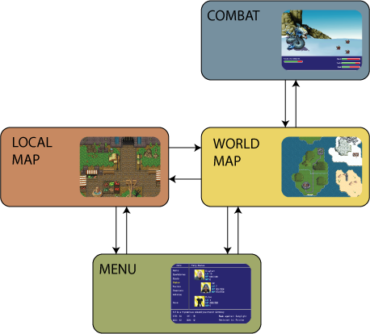
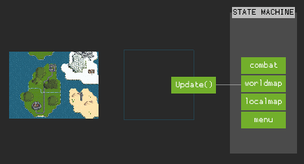
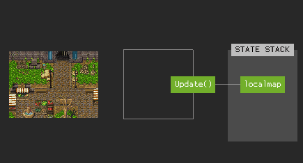

# State

## Basics

As described in [this article][article], a state (or game-state) represents a
"mode" our game is in. For instance, we could separate an RPG in different
game states:

- A "local map" state where the player can move around a terrain
- A "world map" state where a zoomed-out map of the world is displayed
- A "combat" state for fights!
- A "pause menu" state displaying the pause menu of the game
- ...



Essentially, every state has its own `start`, `stop` and `update` functions.

### Usage

To create a state with the `libgote`, **use `calloc`** to allocate a
`gt_state_t` structure and set the callback functions you care about:

```c
gt_state_t *create_combat_state(void)
{
  gt_state_t *state = my_calloc(1, sizeof(gt_state_t));

  state->update = &combat_state_update;
  return (state);
}
```

Of course, `update` isn't the only callback available to game states. Here is
a list of the most commonly used:

- **on_start** - called when the state starts.
- **on_stop** - called when the state stops.
- **update** - called on every iteration of the game loop while the state is
  active.
- **destroy** - called when the state is destroyed, use it to free the `self`
  field.

The `self` field allows you to store arbitrary data associated with your state.
Its value is passed as an argument to all the callbacks. In most cases, you will
use it to keep a reference to data you want to clean-up when the state is
stopped:

```c
/* Structure holding the data associated with the state */
struct combat_state {
  player_t *player;
};

/* Create the player when the state starts */
static void combat_state_on_start(void *ptr, gt_state_data_t *data)
{
  struct combat_state *self = ptr;

  self->player = player_create(data->world);
}

/* Remove the player when the state stops */
static void combat_state_on_stop(void *ptr, gt_state_data_t *data)
{
  struct combat_state *self = ptr;

  player_remove(self->player, data->world);
}

/* Create the state, its data structure, and set the callbacks */
gt_state_t *create_combat_state(void)
{
  gt_state_t *state = my_calloc(1, sizeof(gt_state_t));

  state->self = my_calloc(1, sizeof(struct combat_state));
  state->destroy = &my_free;
  state->on_start = &combat_state_on_start;
  state->on_stop = &combat_state_on_stop;
  return (state);
}
```

**Make sure not to forget to set `state->destroy` to an appropriate freeing
function! If you don't do it, memory *WILL* leak!**

## State machine

Game states are usually managed by something called a **state machine**. It is
the one responsible for calling the right function at every iteration of the
game loop. Only one state can be active at a time!



The state machine is often implemented as a [stack][stack], where states can be
pushed and popped. The state at the top of the stack is the **active state**.



## Transitions

A change in the state machine's stack is called a **state transition**. There
are 4 different kinds of transitions in the `libgote`:

- **Push transitions** - a state is pushed on top of the stack: it becomes the
  active state.
- **Pop transitions** - the state on top of the stack is removed (the state
  below it, if any, becomes active).
- **Switch transitions** - the state on top of the stack is replaced with
  another state.
- **Quit transitions** - all the states are removed from the stack, killing the
  the state machine.

As soon as the state stack becomes empty, the state machine is killed and the
game is effectively terminated.

## Additionnal callbacks

In the `libgote`, states have actually 3 extra callbacks I didn't mention yet.
You might need them in some special cases:

- **on_pause** - called when a state is pushed on top of the current one.
- **on_resume** - called when the state above gets popped.
- **shadow_update** - same as `update`, but is called on ALL the states in the
  stack.

[article]: https://gamedevelopment.tutsplus.com/articles/how-to-build-a-jrpg-a-primer-for-game-developers--gamedev-6676#state
[stack]: https://en.wikipedia.org/wiki/Stack_(abstract_data_type)
